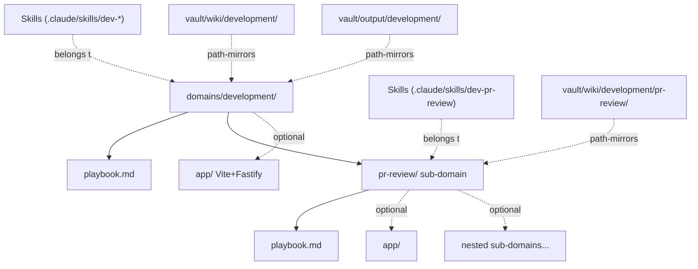

# Domain

## What it is

A **domain** is a folder of related work. It's the OS's top-level unit of organization — anything you do in the OS happens "within" a domain.

A domain contains:

- A **playbook** (`playbook.md`) — the protocol for that domain: what kinds of things live here, what skills exist, what conventions to follow
- Optional **skills** — invokable actions specific to this domain (e.g. `dev-pr-review` in the `development` domain)
- Optional **sub-domains** — further specialization (e.g. `development/pr-review/` is a sub-domain inside `development`)
- An optional **app** — a visual UI for the domain's work (e.g. the OS dashboard lives in the `meta` domain)
- A **vault wiki section** at `vault/wiki/<domain>/` for the domain's structured knowledge

## Domain anatomy



The vault tree mirrors the domain tree path-for-path. This lets any path tell you which domain owns the artifact, and skills know where to read/write for "their" domain.

## When you use it

- Starting work in an area that will accumulate decisions, references, and related skills over time
- Anything that has its own vocabulary, conventions, or workflows distinct from everything else

A one-off task isn't a domain. A theme of recurring work is.

## Example

The OS ships with three domains:

| domain        | what work happens here                           |
| ------------- | ------------------------------------------------ |
| `meta`        | evolving the OS itself; the dashboard lives here |
| `development` | code, repos, PR review                           |
| `research`    | reading, synthesis, decision-capture             |

`development/pr-review/` is a sub-domain — PR review workflows are specific enough to deserve their own folder, but they're still "development."

## How to create one

```
/os add-domain
```

The form asks for `name`, `display_name`, `purpose`, and optional `parent` (for a sub-domain). `meta-add-domain` scaffolds the folder, playbook, and vault sections.

## Related

- [[concept-skill]] — what lives inside a domain
- [[concept-app]] — the optional UI layer
- [[concept-vault]] — where the domain's memory lives
- [[standard-playbook-format]] — the playbook contract
