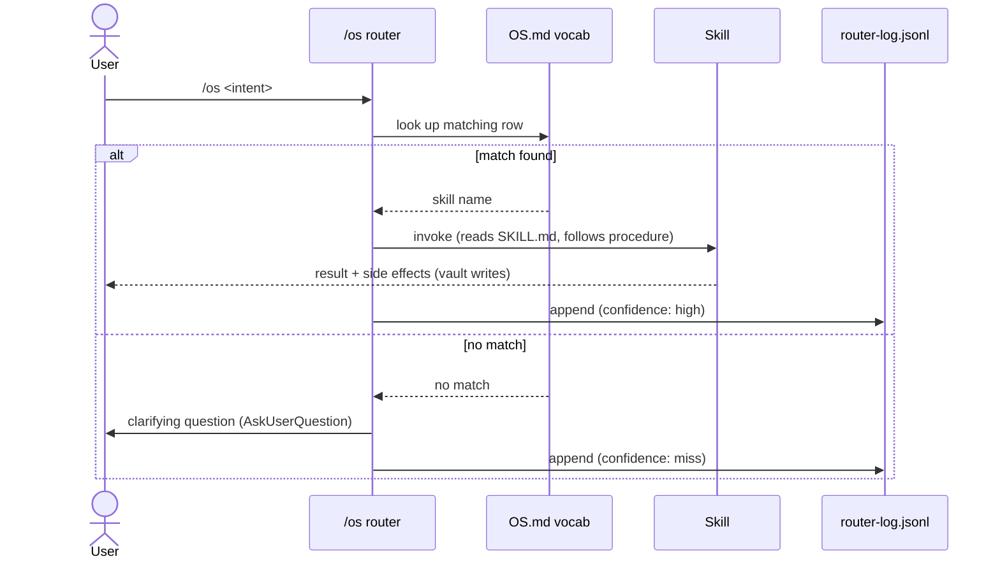

# Router — how `/os <intent>` dispatches

## What it is

The **router** is the `os` skill — the entry point for everything in the OS. You type `/os <whatever you want to do>`, the router reads `OS.md`'s intent vocabulary table, picks the matching skill, and runs it.

It's the canonical way to interact with the OS. Direct skill invocation (e.g. `/meta-brief`) also works, but `/os <intent>` is what you'll use day-to-day.

## How it works



Concrete example:

```
/os add a domain for ops
   → router matches "add domain" → meta-add-domain skill
   → meta-add-domain scaffolds folder + playbook + vault sections
   → router-log entry: {intent: "add a domain for ops", matched: "meta-add-domain", confidence: "high"}
```

## Why it exists

- **You don't have to remember exact skill names.** Type roughly what you mean.
- **One entry point.** Adding new commands = adding a row to OS.md, not memorizing more `/<verb>` aliases.
- **Observable.** Every dispatch is logged. Misses (no vocab match) get logged too, so the vocabulary can grow with use.

## Confidence levels

- **high** — exact phrase match in the vocabulary table
- **low** — partial / fuzzy match; the router asks for clarification via AskUserQuestion
- **miss** — no match; router logs and asks the user what they meant

You can browse all dispatch history in the dashboard's **Router** view, including miss-rate over time.

## Why we don't always type `/os`

For frequent skills, direct invocation (`/meta-brief`, `/dev-pr-review`) skips the router lookup and is slightly faster. The router is the discoverable / forgiving path; direct invocation is the power-user shortcut.

## Related

- [[concept-skill]] — what the router dispatches to
- [[standard-log-formats]] — the JSONL shape of router-log
- [[os]] — the router skill itself (lives at `.claude/skills/os/SKILL.md`)
- [[meta-brief]] — first skill most users invoke via the router (`/os brief`)
- `OS.md` — the canonical intent vocabulary table
