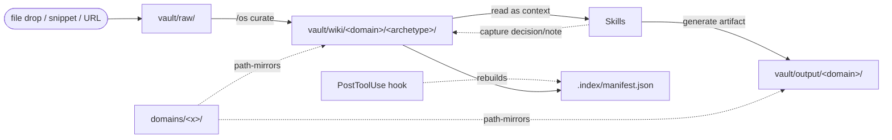

# Vault — the OS's structured memory

## What it is

The **vault** is your structured, persistent memory. It's where the OS captures everything worth remembering across sessions, organized in three stages of structure:

| stage      | path            | what lives here                                                          | committed to git? |
| ---------- | --------------- | ------------------------------------------------------------------------ | ----------------- |
| **raw**    | `vault/raw/`    | unstructured ingest — file drops, conversation snippets, URLs, log files | no                |
| **wiki**   | `vault/wiki/`   | typed, structured entries (one of 6 archetypes, with frontmatter)        | only `_seed/`     |
| **output** | `vault/output/` | generated artifacts (reports, drafts, transcripts)                       | no                |

Things flow **raw → wiki** via curation (`/os curate` or the dashboard's Curation queue). Skills sometimes write directly to **output** (e.g. `dev-pr-review` puts its report there).

> **Not in the vault: telemetry.** The vault holds _knowledge_ — what you've decided, captured, written. Runtime _telemetry_ (every action invocation, its model, tokens, cost, duration, exit status) lives in a separate SQLite store at `.claude/state/events.db`, surfaced in the dashboard's **Insights** view. The vault is curated and ships in `_seed/`; events.db is automatic and gitignored. See [[standard-event-store]] for the separation rationale.

## How memory flows

The vault paths mirror the domain tree: every domain has matching `vault/wiki/<domain>/` and `vault/output/<domain>/` sections. Sub-domains nest identically.

## When you use which

- **Drop into `raw/`** when you have something worth remembering but don't have time/clarity to structure it. Snippets, screenshots, URLs.
- **Promote to `wiki/`** when you've decided what something IS (a decision? a runbook? an entity?). The promotion picks one of the 6 archetypes and adds frontmatter.
- **Write to `output/`** when a skill produces a finished artifact for human or future consumption — a PR review, a synthesis, a draft.

## Why the three-stage model

- Lowering the cost of capture (raw) means more gets remembered
- Raising the cost of promotion (wiki) means only intentional knowledge gets canonical paths + cross-references
- Separating output keeps generated artifacts from being mistaken for hand-curated knowledge

## Index

`vault/.index/manifest.json` is a derived JSON index over all wiki entries, automatically rebuilt by a hook on every Write/Edit. The dashboard, `meta-brief`, and search all read it.

## Privacy

Wiki entries with `private: true` in their frontmatter are excluded from prompts sent to external APIs (e.g. the dashboard's `claude` CLI bridge). Useful for sensitive personal notes.

## How to interact

| action                  | how                                                    |
| ----------------------- | ------------------------------------------------------ |
| Drop something into raw | Just write a file into `vault/raw/`                    |
| Curate raw → wiki       | `/os curate` or dashboard **Curation** view            |
| Browse wiki             | dashboard **Vault** view (wiki tab, filters, search)   |
| Search                  | dashboard Vault search box                             |
| Open a specific entry   | click any `[[wikilink]]` anywhere in rendered markdown |

## Related

- [[standard-wiki-format]] — frontmatter contract for entries
- [[standard-index-schema]] — manifest shape
- [[archetype-entity]], [[archetype-decision]], [[archetype-runbook]], [[archetype-reference]], [[archetype-project]], [[archetype-note]] — the 6 wiki entry types
